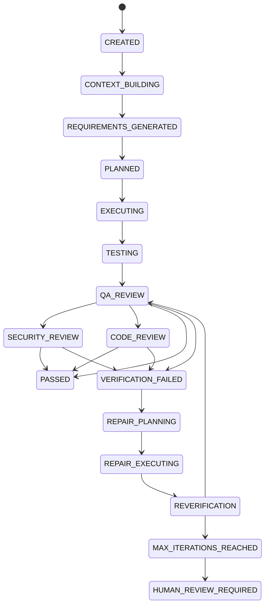

# State Machine

The agent dispatch sequence and state transitions for the AI Software Engineering Harness.

```mermaid
stateDiagram-v2
    [*] --> CREATED
    CREATED --> CONTEXT_BUILDING
    CONTEXT_BUILDING --> REQUIREMENTS_GENERATED
    REQUIREMENTS_GENERATED --> PLANNED
    PLANNED --> EXECUTING
    EXECUTING --> TESTING
    TESTING --> QA_REVIEW
    QA_REVIEW --> SECURITY_REVIEW
    QA_REVIEW --> CODE_REVIEW
    SECURITY_REVIEW --> PASSED
    CODE_REVIEW --> PASSED
    QA_REVIEW --> PASSED
    
    QA_REVIEW --> VERIFICATION_FAILED
    SECURITY_REVIEW --> VERIFICATION_FAILED
    CODE_REVIEW --> VERIFICATION_FAILED
    
    VERIFICATION_FAILED --> REPAIR_PLANNING
    REPAIR_PLANNING --> REPAIR_EXECUTING
    REPAIR_EXECUTING --> REVERIFICATION
    REVERIFICATION --> MAX_ITERATIONS_REACHED
    MAX_ITERATIONS_REACHED --> HUMAN_REVIEW_REQUIRED
    
    REVERIFICATION --> QA_REVIEW
```
