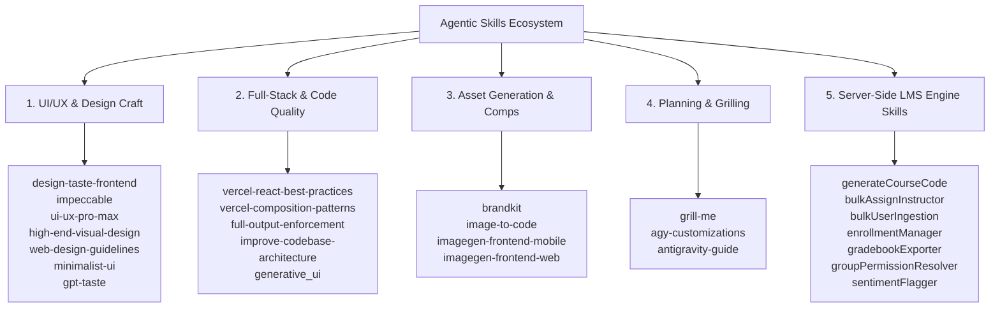
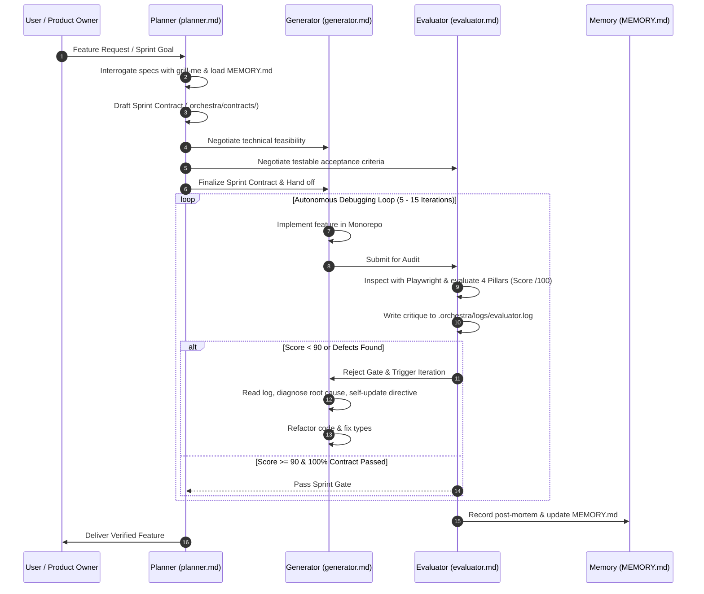

# Agentic Skills, AI Orchestra & AI Engineering Guide

This document catalogs all **agentic skills**, the **Multi-Agent AI Orchestra**, and the exact **AI engineering and prompting methodologies** employed in architecting, developing, and auditing the **CdM LMS** monorepo (Web, Native Mobile, Desktop, and Shared Backend Packages).

---

## 1. Catalog of Agentic Skills

The LMS development lifecycle leverages specialized agentic skills across five major domains:



### 1.1 UI/UX & Aesthetic Design Skills

| Skill Name | Path | Primary Purpose & Capabilities |
| :--- | :--- | :--- |
| **`design-taste-frontend`** | `.agent/skills/design-taste-frontend` | Anti-slop frontend auditor for landing pages and dashboards. Replaces generic templates with intentional design systems, bespoke layouts, and verified micro-interactions. |
| **`impeccable`** | `.agent/skills/impeccable` | Comprehensive design, audit, polish, and optimization skill. Covers visual hierarchy, cognitive load, accessibility (WCAG AA), responsive behavior, safe areas, and design tokens. |
| **`ui-ux-pro-max`** | `.agent/skills/ui-ux-pro-max` | Advanced UI/UX intelligence database covering 50+ active styles, product palettes, font pairings, 119 UX guidelines, and stack-specific React/Next.js/React Native implementations. |
| **`high-end-visual-design`** | `.agent/skills/high-end-visual-design` | Agency-grade visual polish. Eliminates cheap AI defaults (clunky drop-shadows, generic cards, centered bland headers) and enforces subtle gradients, crisp borders, and rhythmic typography. |
| **`web-design-guidelines`** | `.agent/skills/web-design-guidelines` | Audits interfaces for Web Interface Guidelines compliance, accessibility, keyboard focus trapping, screen readers, and touch-target sizing. |
| **`gpt-taste`** | `.agent/skills/gpt-taste` | Advanced UX/UI engineer enforcing wide editorial typography, gapless bento grids, and layout variance. |
| **`minimalist-ui`** | `.agent/skills/minimalist-ui` | Clean editorial style with warm monochrome palettes, typography contrast, and flat bento layouts. |
| **`industrial-brutalist-ui`** | `.agent/skills/industrial-brutalist-ui` | Precision typographic grids, terminal aesthetics, and data-dense dashboards. |
| **`stitch-design-taste`** | `.agent/skills/stitch-design-taste` | Semantic design system generator producing calibrated color schemes, asymmetric layouts, and micro-motion. |
| **`redesign-existing-projects`**| `.agent/skills/redesign-existing-projects`| Audits legacy screens, identifies AI clichés, and upgrades layouts without breaking underlying database bindings. |

### 1.2 Full-Stack Engineering & Code Integrity Skills

| Skill Name | Path | Primary Purpose & Capabilities |
| :--- | :--- | :--- |
| **`vercel-react-best-practices`** | `.agent/skills/vercel-react-best-practices` | React 19 & Next.js performance guidelines: bundle splitting, hydration error prevention, server/client component boundaries, and memoization. |
| **`vercel-composition-patterns`** | `.agent/skills/vercel-composition-patterns` | Scalable React composition patterns, compound components, render props, and context providers eliminating boolean prop proliferation in `packages/ui`. |
| **`full-output-enforcement`** | `.agent/skills/full-output-enforcement` | Overrides default LLM truncation and laziness. Enforces complete, unabridged code generation with zero placeholder comments (`// TODO`, `/* rest of code */`). |
| **`improve-codebase-architecture`**| `.agent/skills/improve-codebase-architecture`| Audits module coupling, separates concerns, prevents shallow abstractions, and maintains clean monorepo layer boundaries. |
| **`generative_ui`** | Built-in | Renders rich interactive UI widgets, data visualizations, and charts inline. |

### 1.3 Asset Generation & Multi-Modal Skills

| Skill Name | Path | Primary Purpose & Capabilities |
| :--- | :--- | :--- |
| **`brandkit`** | `.agent/skills/brandkit` | Generates high-end brand identity systems, logo variations, institute palette boards, and visual decks. |
| **`image-to-code`** | `.agent/skills/image-to-code` | Analyzes visual mockups or design screenshots and accurately translates them into clean Tailwind CSS / React Native code. |
| **`imagegen-frontend-mobile`** | `.agent/skills/imagegen-frontend-mobile` | Generates native mobile app visual concepts with clean phone mockups and platform-appropriate typography. |
| **`imagegen-frontend-web`** | `.agent/skills/imagegen-frontend-web` | Generates section-by-section web comp references for landing pages and complex dashboards. |

### 1.4 Specification & Interrogation Skills

| Skill Name | Path | Primary Purpose & Capabilities |
| :--- | :--- | :--- |
| **`grill-me`** | `.agent/skills/grill-me` | Interrogates underspecified requirements, stress-tests edge cases, and challenges architectural shortcuts before code is written. |
| **`agy-customizations`** | Built-in | Reference guide for configuring custom skills, rules, hooks, and MCP servers. |
| **`antigravity-guide`** | Built-in | Reference for Antigravity IDE, CLI, subagents, and memory systems. |

### 1.5 Server-Side LMS Engine Skills (`apps/web/src/lib/skills/`)

These are composable, deterministic backend skills baked into the LMS server logic:

| Server Skill | File Path | Functionality |
| :--- | :--- | :--- |
| **`generateCourseCode`** | `src/lib/skills/generate-course-code.ts` | Generates collision-safe, alphanumeric join codes for instant course access. |
| **`bulkAssignInstructor`** | `src/lib/skills/bulk-assign-instructor.ts` | Atomic multi-instructor assignment across department courses with Prisma transactions. |
| **`bulkUserIngestion`** | `src/lib/skills/bulk-user-ingestion.ts` | Parses CSV/JSON rosters, creates student profiles, and assigns initial passwords. |
| **`enrollmentManager`** | `src/lib/skills/enrollment-manager.ts` | Processes student join requests, course capacity checks, and approval queues. |
| **`gradebookExporter`** | `src/lib/skills/gradebook-exporter.ts` | Compiles UTF-8 BOM CSV exports compatible with Excel and institutional registries. |
| **`groupPermissionResolver`** | `src/lib/skills/group-permission-resolver.ts`| Filters classwork and syllabus visibility based on student group membership. |
| **`sentimentFlagger`** | `src/lib/skills/sentiment-flagger.ts` | Automated sentiment analysis on student comments to detect academic distress or disengagement. |

---

## 2. The Multi-Agent AI Orchestra System

The LMS development pipeline is governed by a **3-Role Multi-Agent Orchestra** operating through an autonomous, contract-driven debugging loop.



### 2.1 Agent Role Specifications

#### 1. Planner (`.orchestra/agents/planner.md`)
- **Mission:** Upstream architect. Prevents premature coding by drafting rigid **Sprint Contracts** (`.orchestra/contracts/sprint-contract-[ID].md`).
- **Core Skills:** `grill-me`, `improve-codebase-architecture`.
- **Enforcement:** Enforces monorepo design invariants (Atomic UI in `packages/ui`, dynamic theming, Prisma transactions).

#### 2. Generator (`.orchestra/agents/generator.md`)
- **Mission:** Fullstack implementation engine. Writes Next.js App Router code, Expo Native Mobile screens, Prisma queries, and state management.
- **Core Skills:** `vercel-react-best-practices`, `vercel-composition-patterns`, `full-output-enforcement`.
- **Autonomous Debug Loop:** Reads evaluator logs, diagnoses root causes, self-updates `.orchestra/prompts/generator-directive.md`, and refactors code.

#### 3. Evaluator (`.orchestra/agents/evaluator.md`)
- **Mission:** Uncompromising, harsh QA auditor. Never accepts "good enough". Grills the implementation with live browser inspection, Playwright tools, and accessibility checks.
- **Core Skills:** `impeccable`, `design-taste-frontend`, `high-end-visual-design`, `ui-ux-pro-max`, `web-design-guidelines`.

---

### 2.2 The 4-Pillar Evaluation Rubric (100 Points Total)

Every feature must score **$\ge 90/100$** to pass the evaluation gate:

| Pillar | Max Points | Evaluation Criteria |
| :--- | :---: | :--- |
| **1. Design Quality** | **25** | Visual coherence, balanced hierarchy, purposeful spacing rhythm, natural institute theme integration (`ics`, `ibe`, `ite`) without crude color washes. |
| **2. Originality** | **25** | Anti-slop enforcement, bespoke editorial layouts, custom quick-action pills, domain-specific LMS tables, zero generic templates. |
| **3. Craft** | **25** | Wide editorial typography, proper tabular numbers (`font-mono` on grades/dates), smooth transition states, min 44x44px touch targets, WCAG AA contrast. |
| **4. Functionality** | **25** | Zero ambiguity for users, shimmering loading skeletons, rich empty states, error recovery, 100% contract compliance, live database integration. |

---

## 3. AI Engineering & Prompting Protocols

To guarantee deterministic, production-grade output from LLMs across a complex monorepo, the following prompt engineering methodologies are strictly enforced:

### 3.1 Strict Invariant Prompting

All system prompts and agent directives embed non-negotiable monorepo rules:

```markdown
1. UI Components: ALL shared components MUST go into `packages/ui` following Atomic UI patterns. Use Lucide React icons exclusively.
2. Theming: Never hardcode institute colors. Always resolve via `getInstituteTheme(instituteCode)`.
3. Database: Always run `npx prisma generate` after schema changes. Multi-model updates MUST use `prisma.$transaction([...])`.
4. Typing: Strict TypeScript interfaces for all Prisma models. Zero use of `any`.
5. Mobile Viewport Defense: Set text input sizes to `text-base` (16px) on mobile viewports to prevent iOS Safari auto-zoom. Interactive touch targets must be $\ge 44\text{px}$.
```

### 3.2 Autonomous Self-Updating Directives

Instead of requiring continuous human re-prompting during debugging, the Generator uses a **self-reflective prompt file** (`.orchestra/prompts/generator-directive.md`):

```markdown
# Structure of Generator Directive:
1. Current Sprint Objective & Contract Link
2. Latest Evaluator Log Parsing & Root Cause Analysis
3. Targeted Refactoring Plan
4. Invariant Checklist (Types, Mobile Touch Targets, Prisma Transactions)
5. Execution Steps
```

### 3.3 Negative Constraint Prompting (Anti-Slop)

Prompt directives explicitly ban common generative AI failure modes:
- **Banned:** Placeholder code (`// TODO: implement later`, `/* rest of your code */`).
- **Banned:** Fake or wireframe UI on mobile (all mobile cards and tabs must connect 1-to-1 to real Prisma database endpoints).
- **Banned:** Generic centered cards with heavy black drop-shadows.
- **Banned:** Unpaginated API requests that overload mobile memory.
- **Banned:** Rogue tabs in Expo Router (all non-tab child screens must declare `options={{ href: null }}`).

### 3.4 Multi-Turn Memory Persistence (`.orchestra/memory/MEMORY.md`)

At the conclusion of every sprint, the orchestra appends lessons learned to long-term memory. Future subagents load this ledger at initialization to ensure past regressions are never repeated across conversation boundaries.
