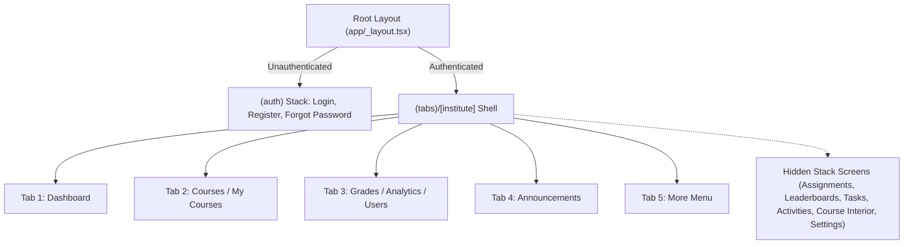

# Lumina LMS - Mobile Application Scope, Architecture & Features

This document provides a comprehensive technical overview and feature specification for the mobile client in the **Lumina LMS** monorepo. It details everything from the frontend runtime, UI/UX structure, navigation patterns, and institute-specific theming to the backend API services, database interactions, and shared monorepo packages.

---

## 1. Technical Stack & Core Infrastructure

| Layer | Technology & Version | Role & Description |
| :--- | :--- | :--- |
| **Framework** | **Expo (`~55.0.28`)** & **React Native (`0.83.10`)** | Cross-platform runtime targeting iOS and Android with React 19 (`19.2.0`) and New Architecture enabled (`newArchEnabled: true`). |
| **Routing** | **Expo Router (`~55.0.17`)** | File-based, typed routing located in `apps/mobile/app/`. |
| **State & Auth** | **Zustand (`^5.0.14`)** + **Expo SecureStore (`~55.0.16`)** | Central state manager with persistent encrypted key-value storage for bearer tokens and user profile cache. |
| **Theming** | Dynamic Multi-Institute Engine | Custom theming system (`useTheme`, `getInstituteTheme`) dynamically resolving palettes based on route parameters and institute identity. |
| **Icons & Media** | **Lucide React Native (`^0.468.0`)** & **Expo Linear Gradient (`~55.0.16`)** | Vector iconography and visual gradient cards/hero banners. |
| **API Client** | **`@lms/api-client`** | Monorepo SDK providing strictly typed REST wrappers with automated Bearer token injection. |
| **Shared Packages** | **`@lms/types`**, **`@lms/config`** | Shared TypeScript interfaces and institute configuration definitions across web, mobile, and desktop. |

---

## 2. Directory Structure (`apps/mobile`)

```text
apps/mobile/
├── app/
│   ├── (auth)/
│   │   ├── _layout.tsx              # Auth stack navigator
│   │   ├── login.tsx                # Multi-institute login screen
│   │   ├── register.tsx             # Student registration screen
│   │   └── forgot-password.tsx      # Password recovery screen
│   ├── (tabs)/
│   │   ├── [institute]/
│   │   │   ├── _layout.tsx          # Dynamic 5-tab navigation with RBAC adaptation
│   │   │   ├── index.tsx            # Dashboard / Home screen
│   │   │   ├── courses/
│   │   │   │   ├── index.tsx        # Course list directory
│   │   │   │   └── [courseId].tsx   # 4-Tab course workspace (Stream, Classwork, People, Grades)
│   │   │   ├── assignments/
│   │   │   │   └── index.tsx        # Consolidated To-do & assignments screen
│   │   │   ├── announcements/
│   │   │   │   └── index.tsx        # Campus & course announcements feed
│   │   │   ├── grades/
│   │   │   │   └── index.tsx        # Academic performance & grades screen
│   │   │   ├── leaderboards/
│   │   │   │   └── index.tsx        # Institute student leaderboards & streaks
│   │   │   ├── activities/
│   │   │   │   └── index.tsx        # Interactive labs & simulations root
│   │   │   ├── tasks/
│   │   │   │   └── index.tsx        # Personal study task tracker
│   │   │   ├── profile/
│   │   │   │   └── index.tsx        # User profile & sign-out screen
│   │   │   └── more/
│   │   │       ├── index.tsx        # Feature menu hub
│   │   │       ├── settings.tsx     # Application settings
│   │   │       ├── help.tsx         # Help & support documentation
│   │   │       └── privacy.tsx      # Privacy policy
│   │   └── _layout.tsx              # Tabs wrapper
│   └── _layout.tsx                  # Root gatekeeper & global auth listener
├── src/
│   ├── components/
│   │   └── common/
│   │       ├── Badge.tsx            # Status & pill badge component
│   │       ├── Button.tsx           # Button with loading & variant states
│   │       ├── Card.tsx             # Surface container component
│   │       ├── EmptyState.tsx       # Standard empty placeholder UI
│   │       ├── Input.tsx            # Form text input component
│   │       ├── LoadingSpinner.tsx   # Centered activity indicator
│   │       ├── ScreenHeader.tsx     # Top navigation screen header
│   │       └── UnderDevelopment.tsx # Placeholder for upcoming modules
│   ├── hooks/
│   │   ├── useApi.ts                # API client hook
│   │   ├── useRefresh.ts            # Pull-to-refresh helper
│   │   └── useTheme.ts              # Institute theme resolver hook
│   ├── institutes/
│   │   ├── ics/config.ts            # ICS metadata & feature flags
│   │   ├── ibe/config.ts            # IBE metadata & feature flags
│   │   └── ite/config.ts            # ITE metadata & feature flags
│   ├── lib/
│   │   ├── constants.ts             # API Base URL & App constants
│   │   └── theme.ts                 # Institute color maps & theme definitions
│   ├── screens/
│   │   ├── CodeLabBrowserScreen.tsx # Interactive coding problem bank browser
│   │   └── CodeLabScreen.tsx        # Monospace code editor & evaluation runner
│   └── stores/
│       └── auth-store.ts            # Zustand authentication & session store
├── app.json                         # Expo configuration (bundle ID, scheme, permissions)
└── package.json                     # Monorepo dependencies & scripts
```

---

## 3. Multi-Institute Theming System

The mobile application dynamically inherits the visual identity of the user's institute via `getInstituteTheme()`:

| Institute | Code | Primary Color | Secondary / Dark | Background | Brand Character |
| :--- | :--- | :--- | :--- | :--- | :--- |
| **Institute of Computing Studies** | `ics` | `#FF7517` (Orange) | `#2C2727` | `#F6F4F4` | High-energy tech, coding labs, hardware simulations |
| **Institute of Business & Entrepreneurship** | `ibe` | `#D4A017` (Gold/Amber) | `#2C2727` | `#FAF8F1` | Executive, financial analysis, leadership |
| **Institute of Teacher Education** | `ite` | `#2563EB` (Blue) | `#1F2937` | `#F5F7FB` | Modern academic, pedagogical, structured |

---

## 4. Authentication, Security & Session Management

- **Session Token Storage**: Authenticated session IDs are saved into iOS Keychain and Android Keystore via `expo-secure-store` under `lumina_auth_token`. User identity is cached under `lumina_user`.
- **Token Verification**: On app launch (`app/_layout.tsx`), the root layout verifies the stored token by calling `/api/auth/me`. If invalid or expired, SecureStore is cleared, and the user is redirected to `/(auth)/login`.
- **Bearer Token Authorization**: Every API request sent through `@lms/api-client` injects `Authorization: Bearer <token>`. On the backend, `getSessionFromRequest()` parses this header and resolves the session from PostgreSQL.
- **Login Rewards Integration**: Successful logins trigger `processLoginReward(userId)` on the backend to update login streaks and reward daily gamification EXP.

---

## 5. Navigation & Role-Based Access Control (RBAC)

The bottom tab navigation dynamically adapts based on the active role (`STUDENT`, `PROFESSOR`/`TEACHER`, `ADMIN`):



### Tab Configuration by Role

| Tab Position | Student View | Professor / Instructor View | Administrator View |
| :--- | :--- | :--- | :--- |
| **1** | **Dashboard** (`LayoutDashboard`) | **Dashboard** (`LayoutDashboard`) | **Dashboard** (`LayoutDashboard`) |
| **2** | **Courses** (`BookOpen`) | **My Courses** (`BookOpen`) | **Courses** (`Library`) |
| **3** | **Grades** (`Trophy`) | **Analytics** (`ChartBar`) | **Users** (`Users`) |
| **4** | **Announcements** (`Megaphone`) | **Announcements** (`Megaphone`) | **Announcements** (`Megaphone`) |
| **5** | **More** (`Menu`) | **More** (`Menu`) | **More** (`Menu`) |

---

## 6. Detailed Feature & Screen Breakdown

### 6.1 Dashboard / Home (`app/(tabs)/[institute]/index.tsx`)
- **Linear Gradient Hero Banner**: Renders institute name, user greeting, and ambient light glow.
- **Live Gamification Metrics**: Badges displaying active **Login Streak** (e.g. *5 Days Streak*), **Total EXP** (*120 EXP*), and **Student Level** (*Lvl 3*).
- **Quick-Actions Carousel**: Horizontal scroll buttons for fast navigation:
  - *Join Class* (opens course browser/join workflow).
  - *To-do* (includes dynamic numerical badge for pending assignments).
  - *Flashcards* (links to study decks).
  - *Tasks* (opens personal task list).
  - *CodeLab* (opens interactive coding lab).
  - *Leaderboard* (opens institute rankings).
- **Enrolled Classes Stack**: Renders course cards with custom code badges, section tags, instructor name, and classroom room number.
- **Due Soon Deadlines Feed**: Aggregates coursework due within 7 days with calculated urgency badges:
  - `Overdue` (Red badge)
  - `Due Today` (Amber badge)
  - `Due Tomorrow` (Yellow badge)
  - `Due <Month Day>` (Muted badge)

### 6.2 Course Workspace (`app/(tabs)/[institute]/courses/[courseId].tsx`)
A full 4-tab Google Classroom-style interior workspace:
1. **Stream Tab**:
   - Pinned instructor broadcasts and high-priority notices.
   - Interactive announcement composer allowing students and instructors to post messages directly to the course feed.
   - Chronological stream cards with author avatars, roles, and timestamps.
2. **Classwork Tab**:
   - Syllabus organized into categories: *Assignments*, *Quizzes & Assessments*, *Learning Materials*, and *Other Modules*.
   - Displays max points, due dates, urgency badges, and submission completion state (*Done* checkmark vs. pending).
   - **Interactive Submission Modal**:
     - View assignment description and teacher reference attachments.
     - Enter cloud document or git repository URL.
     - Toggle between **"Turn In Assignment"** and **"Mark as Incomplete (Unsubmit)"**.
3. **People Tab**:
   - Instructor identity card with email and role badge.
   - Enrolled student roster showing classmate names, student numbers, and total enrollment count.
4. **Grades Tab**:
   - **Course Standing Summary**: Average percentage score, calculated letter grade (A–F), points earned vs. possible, and count metrics (*Completed*, *Graded*, *Missing*).
   - **Assessment Breakdown**: Itemized coursework list with individual scores, point ceilings, and status chips (`GRADED`, `SUBMITTED`, `MISSING`, `ASSIGNED`).
   - **Instructor Feedback Feed**: Private evaluation notes and direct feedback from the professor.

### 6.3 Course Directory (`app/(tabs)/[institute]/courses/index.tsx`)
- Lists all active courses in the institute with course codes, section numbers, instructor names, and room locations.

### 6.4 Assignments & To-Do (`app/(tabs)/[institute]/assignments/index.tsx`)
- Consolidated feed of all coursework, assignments, and quizzes across all enrolled subjects with point values, descriptions, and due dates.

### 6.5 Announcements (`app/(tabs)/[institute]/announcements/index.tsx`)
- Institute-wide bulletin notices and course-specific announcements with author attribution and formatted timestamps.

### 6.6 Grades & Academic Records (`app/(tabs)/[institute]/grades/index.tsx`)
- Global academic grade record displaying scores across all enrolled courses.

### 6.7 Leaderboard & Streaks (`app/(tabs)/[institute]/leaderboards/index.tsx`)
- Live student rankings within the institute sorted by gamification points.
- Distinct gold/primary highlights for top-3 students and flame indicators for continuous daily study streaks.

### 6.8 Interactive CodeLab (`src/screens/CodeLabScreen.tsx` & `CodeLabBrowserScreen.tsx`)
- **Problem Bank Browser**: Filter coding exercises across Python, C++, C#, Java, JavaScript, and SQL by difficulty tier (Easy, Intermediate, Hard) and hashtags.
- **Mobile Code Editor**: Monospace dark-mode code editor with character counters and syntax styling.
- **Evaluation Runner**: In-app code test runner simulating remote execution (Judge0 integration) with test case results, scores, and expected vs. actual output diffs.

### 6.9 Personal Tasks (`app/(tabs)/[institute]/tasks/index.tsx`)
- Student study schedule and to-do task tracker.

### 6.10 Profile & Secondary Pages
- **Profile (`profile/index.tsx`)**: Account identity, student number, institute affiliation, role badge, and secure sign-out.
- **More Hub (`more/index.tsx`)**: Central navigation menu grouping LMS tools and settings.
- **Settings (`more/settings.tsx`)**, **Help (`more/help.tsx`)**, and **Privacy (`more/privacy.tsx`)**.

---

## 7. Backend API Endpoints Supporting Mobile

All mobile requests connect to Next.js route handlers located in `apps/web/src/app/api/`:

| Route | Method | Description |
| :--- | :--- | :--- |
| `/api/auth/login` | `POST` | Validates credentials, creates database session, returns bearer token, and processes daily login rewards. |
| `/api/auth/register` | `POST` | Registers new user and links institute profile. |
| `/api/auth/me` | `GET` | Validates active mobile bearer token. |
| `/api/auth/logout` | `POST` | Destroys active database session. |
| `/api/courses?institute=:code` | `GET` | Fetches courses for the user filtered by institute. |
| `/api/courses/:courseId` | `GET` | Fetches course metadata and instructor details. |
| `/api/courses/:courseId/stream` | `GET` / `POST` | Retrieves stream announcements and broadcast notices; creates new announcement. |
| `/api/courses/:courseId/classwork` | `GET` | Retrieves syllabus items, attachments, and student submission status. |
| `/api/courses/:courseId/submissions` | `POST` | Creates/updates student assignment submission and links external attachments. |
| `/api/courses/:courseId/people` | `GET` | Retrieves course instructor and approved enrolled student list. |
| `/api/courses/:courseId/grades` | `GET` | Computes average percentage, letter grade, points breakdown, and returns feedback notes. |
| `/api/assignments?institute=:code` | `GET` | Retrieves upcoming assignments and coursework for enrolled subjects. |
| `/api/announcements?institute=:code`| `GET` | Retrieves institute bulletin announcements with pagination. |
| `/api/leaderboard?institute=:code` | `GET` | Queries student gamification rankings and streaks. |
| `/api/profile` | `GET` / `PUT` | Retrieves and updates student bio, phone, department, and academic year. |

---

## 8. Summary of Shared Monorepo Packages

- **`@lms/api-client` (`packages/api-client`)**: Unified SDK with structured namespaces (`auth`, `courses`, `announcements`, `grades`, `assignments`, `leaderboard`, `profile`, `institutes`) ensuring uniform error handling (`ApiClientError`) and automated token injection.
- **`@lms/types` (`packages/types`)**: Strict TypeScript definitions for Prisma models, API request/response payloads, and UI structures.
- **`@lms/config` (`packages/config`)**: Institute configurations, route constants, and shared environment settings.
